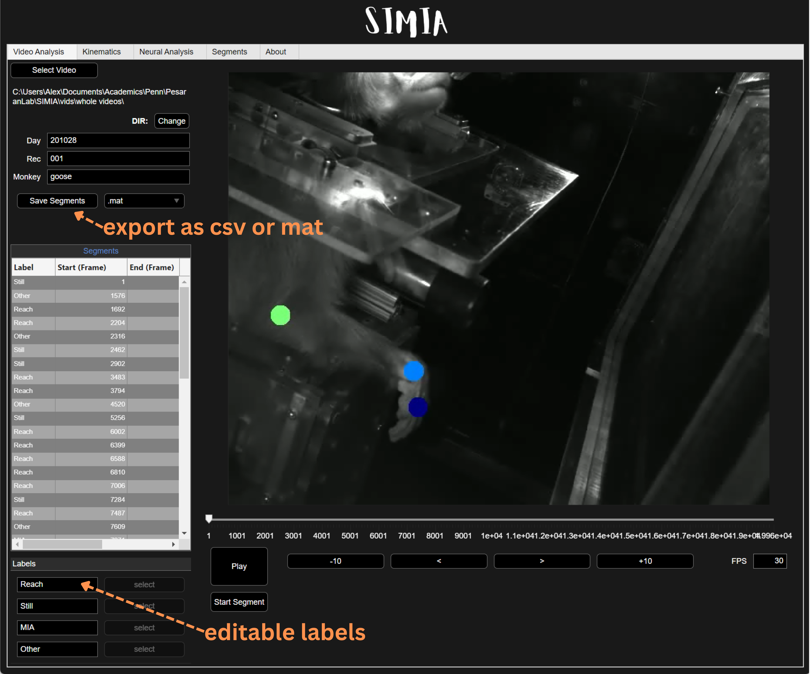
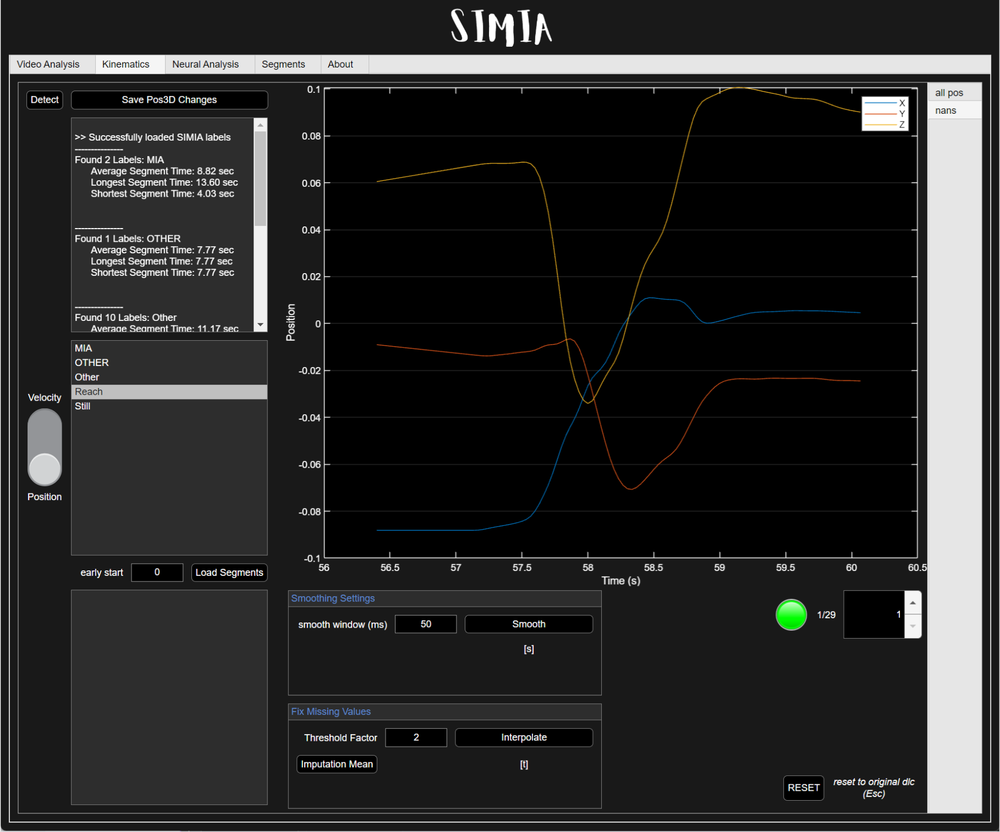
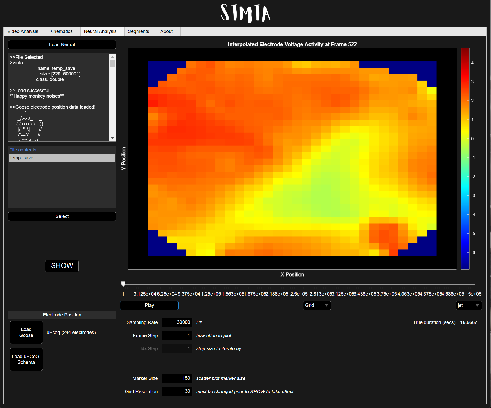

# SIMIA

This is an application that serves to streamline motor decoding research for the Pesaran Lab. 

### To install:
Go to the Releases tab on this GitHub repo and download the latest compiled version of your choosing. Currently, SIMIA app can be used as a stand-alone Windows application or as a MATLAB App on all operating systems 2023b or newer. There are no package dependencies required prior to installing.

### Key features

* Video segmentation tool with customizable labels
  * Includes a smart segmentation option (highly dependant on DCL/task quality)

* DLC kinematic analysis on loaded labels 
  * Can clean segmented labels (e.g. smooth, interpolation, include early-start)

* Neural analysis window for uECoG spatial video with configurable electrode schema

* More updates coming...

### Extras
To contribute, fork and submit a pull request with the desired updates!

Created and maintained by Alex Estrada - UPenn Pesaran Lab 2024 